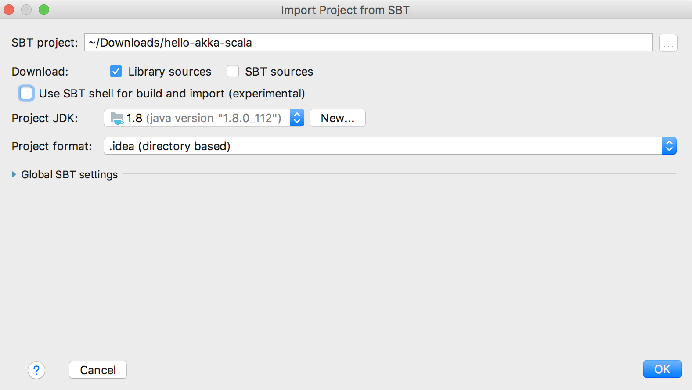
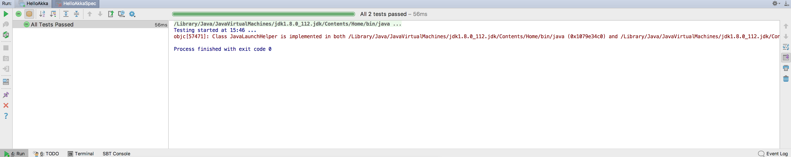
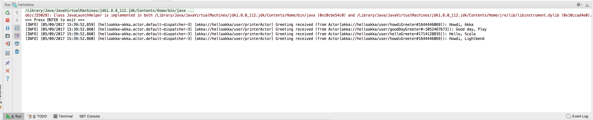

## IntelliJ IDEA

[IntelliJ](https://www.jetbrains.com/idea/) from JetBrains is one of the leading IDEs in the Java/Scala community and it has excellent support for Akka. This section will guide you through setting up, testing and running the sample project.

### Setting up the project

Open IntelliJ and select `File -> Open...` and point to the directory where you have installed the sample project. A dialogue like this will pop up:

Fill out the settings according to the above and press `OK` to import the project. When IntelliJ will warn about missing Scala SDK it is only to follow the instructions to add support.

### Inspecting project code

If we open up the file `src/main/scala/$package$/AkkaQuickstart.scala` we will see a lot of lines beginning with `//# ...`. These lines are used as directives for this documentation. To get rid of these lines from the source code we can utilize the awesome Find/Replace functionality in IntelliJ. Select `Edit -> Find -> Replace in Path...`. Check the `Regex` box and add the following regex `[//#].*` and click on `Replace in Find Window...`. Select to replace all occurrences and voila the lines are gone!

### Testing and running

For testing we simply right click on the file `src/test/scala/$package$/AkkaQuickstartSpec.scala` and select `Run 'AkkaQuickstartSpec'`:

Similarly to run the application we right click on the file `src/main/scala/$package$/AkkaQuickstart.scala` and select `Run 'AkkaQuickstart'`:

For more detailed information about please see the @ref:[running the application](running-the-application.md) section.
